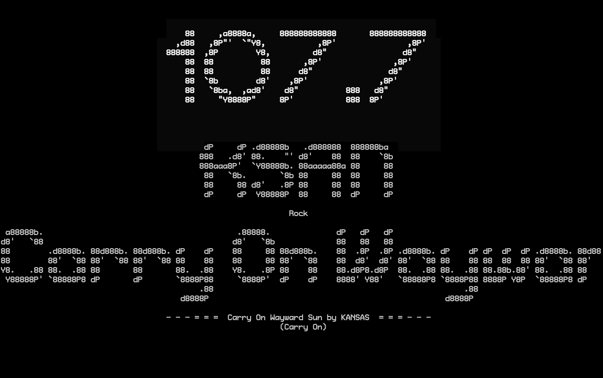

# Gofm

**What is it?**

A pure-Go interface for the si4703 chip attached to RPi GPIO.  Initializes the chipset, can tune up and down the radio dial (North America), and can even interpret a subset of the RDS stream as provided by the si4703.

It's pretty rough, and full of bugs, but works well-enough to listen to the radio.

- - - -

- Bart
